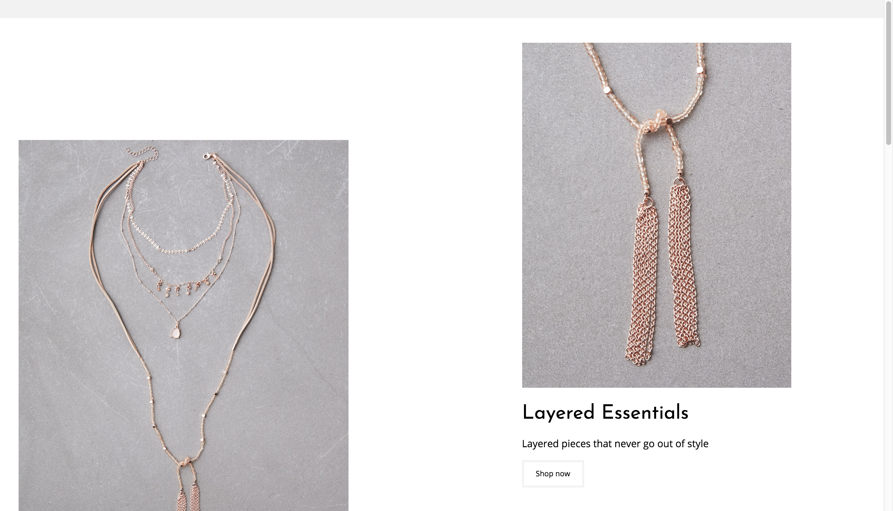

# advanced-css-grid-tutorial

Quick Advanced CSS grid tutorial. 

**Original Tutorial**

<a href="https://danwebb.co/journal/how-to-build-complicated-grids-using-css-grid?utm_source=Responsive+Design+Weekly&utm_campaign=2183004dce-RWD_Newsletter_318&utm_medium=email&utm_term=0_df65b6d7c8-2183004dce-59140565&mc_cid=2183004dce&mc_eid=9c9c667028" target="blank">Advanced CSS Grid Tutorial</a>

**Screenshots**

**Live link:**
<a href="https://aheitzen.github.io/gallery-grid/" target="blank">Advanced CSS Grid Tutorial Live Link</a>

**Technologies used**
* HTML5
* CSS 3
* CSS Grid
* Google Fonts

